# Tata Car Resale Price Prediction Using Machine Learning

## Project Overview

This project is a regression machine learning project that predicts the resale price of Tata cars based on vehicle features such as model, variant, fuel type, transmission, body type, engine capacity, power, mileage, year, kilometres driven, ownership count, accident history, and ex-showroom price.

The goal of this project is to practise the full Data Science and Machine Learning lifecycle from data collection to model deployment.

The project follows these stages:

1. Data Collection
2. Data Cleaning
3. Exploratory Data Analysis
4. Model Building
5. Model Evaluation
6. Model Deployment

---

## Business Problem

Car buyers, sellers, and dealerships often need a reliable way to estimate the resale value of used cars.

Manual car price estimation can be inconsistent because resale price depends on several factors, including:

- Car model
- Car variant
- Fuel type
- Transmission
- Body type
- Engine capacity
- Mileage
- Manufacturing year
- Kilometres driven
- Ownership count
- Accident history
- Original ex-showroom price

The goal of this project is to build a machine learning model that can estimate Tata car resale prices more consistently using historical car data.

---

## Dataset

The dataset was collected from Kaggle.

Each row in the dataset represents one Tata car record.

The target variable is:

`resale_price_lakh`

This means the model is trained to predict the resale price of each car in lakhs.

---

## Problem Type

This project is a **Supervised Machine Learning Regression** problem.

The objective is to predict the resale price of a Tata car based on its features.

Unlike a classification problem, where the output is a category (such as Yes/No or Spam/Not Spam), this project predicts a continuous numerical value.

The target variable is:

```text
resale_price_lakh
```

Since the model predicts a continuous value, regression algorithms were used.

The regression models were evaluated using:

- Mean Absolute Error (MAE)
- Root Mean Squared Error (RMSE)
- R² Score

The model with the best overall performance was selected for deployment in the Streamlit web application.

---

## Tools and Technologies Used

This is a regression machine learning problem because the target variable is a continuous numerical value and the model predicts a price, not a category. This project was completed using the following tools and technologies:

- Python
- Pandas
- NumPy
- Matplotlib
- Seaborn
- Scikit-learn
- Joblib
- Streamlit
- Jupyter Notebook
- VS Code
- Git
- GitHub

### Why these tools were used

Python was used as the main programming language for data analysis, machine learning, and deployment.

Pandas and NumPy were used for loading, cleaning, and preparing the dataset.

Matplotlib and Seaborn were used for data visualisation during exploratory data analysis.

Scikit-learn was used to build preprocessing pipelines, train regression models, evaluate model performance, and make predictions.

Joblib was used to save the trained model and supporting files for deployment.

Streamlit was used to build an interactive web application where users can enter car details and receive a resale price prediction.

Git and GitHub were used for version control and portfolio presentation.


## Model Deployment

After training and comparing the regression models, the best-performing model was saved using Joblib and deployed using Streamlit.

The purpose of deployment is to make the machine learning model usable outside the notebook environment. Instead of only running predictions inside Jupyter Notebook, the Streamlit app allows a user to enter car details and receive a predicted resale price through a simple interface.

The deployed app allows users to enter:

- Brand
- Model
- Variant
- Fuel type
- Transmission
- Body type
- Engine capacity
- Power
- Mileage
- Ex-showroom price
- Manufacturing year
- Kilometres driven
- Owner count
- Accident history

The app then converts the user input into a Pandas DataFrame and sends it to the saved machine learning pipeline for prediction.

### Deployment Files

The following files were saved for deployment:

```text
best_tata_car_price_model.joblib
model_columns.joblib
feature_options.joblib
```
Predicted resale price = 4.90 lakh

## Project Architecture

This project follows the full machine learning workflow from data collection to deployment.

The architecture shows how the raw dataset moves through cleaning, EDA, feature engineering, preprocessing, model training, evaluation, best model selection, model saving, and finally deployment using Streamlit.

```text
Dataset
   │
   ▼
Data Cleaning
   │
   ▼
Exploratory Data Analysis (EDA)
   │
   ▼
Feature Engineering
   │
   ▼
Data Preprocessing
   │
   ▼
Model Training
   │
   ▼
Model Evaluation
   │
   ▼
Best Model Selection
   │
   ▼
Model Serialization (.joblib)
   │
   ▼
Streamlit Web Application
   │
   ▼
Tata Car Resale Price Prediction
```

This architecture helps explain how the project moves from raw data to a usable machine learning application.
```

```
## Results Summary

Several regression models were trained and evaluated to predict Tata car resale prices.

The models were compared using:

- Mean Absolute Error (MAE)
- Root Mean Squared Error (RMSE)
- R² Score

After comparing all models, the best-performing model was selected and saved for deployment.

The final machine learning pipeline was serialized using Joblib and integrated into a Streamlit web application for real-time price prediction.
```

```
## Future Improvements

Future enhancements for this project include:

- Deploy the Streamlit application on Streamlit Community Cloud.
- Add model explainability using SHAP values.
- Enable users to upload CSV files for batch predictions.
- Connect the application to a cloud database.
- Add user authentication.
- Containerize the application using Docker.
- Deploy the application on Azure App Service or AWS.
- Build an automated CI/CD pipeline using GitHub Actions.

```

```
## Lessons Learned

Throughout this project I gained practical experience in:

- Cleaning real-world datasets.
- Performing exploratory data analysis.
- Feature engineering.
- Building multiple regression models.
- Evaluating models using MAE, RMSE and R² Score.
- Saving trained models using Joblib.
- Building a Streamlit web application.
- Preparing a complete machine learning portfolio project.
- Using Git and GitHub for version control.

```

```
## Key Achievements

- Built an end-to-end machine learning regression project.
- Compared multiple regression algorithms.
- Selected the best-performing model using evaluation metrics.
- Saved the trained model using Joblib.
- Developed an interactive Streamlit web application.
- Documented the entire machine learning workflow.
- Published the complete project on GitHub as a portfolio-ready repository.

```

## Project Screenshots

### Streamlit Applications

#### Homepage
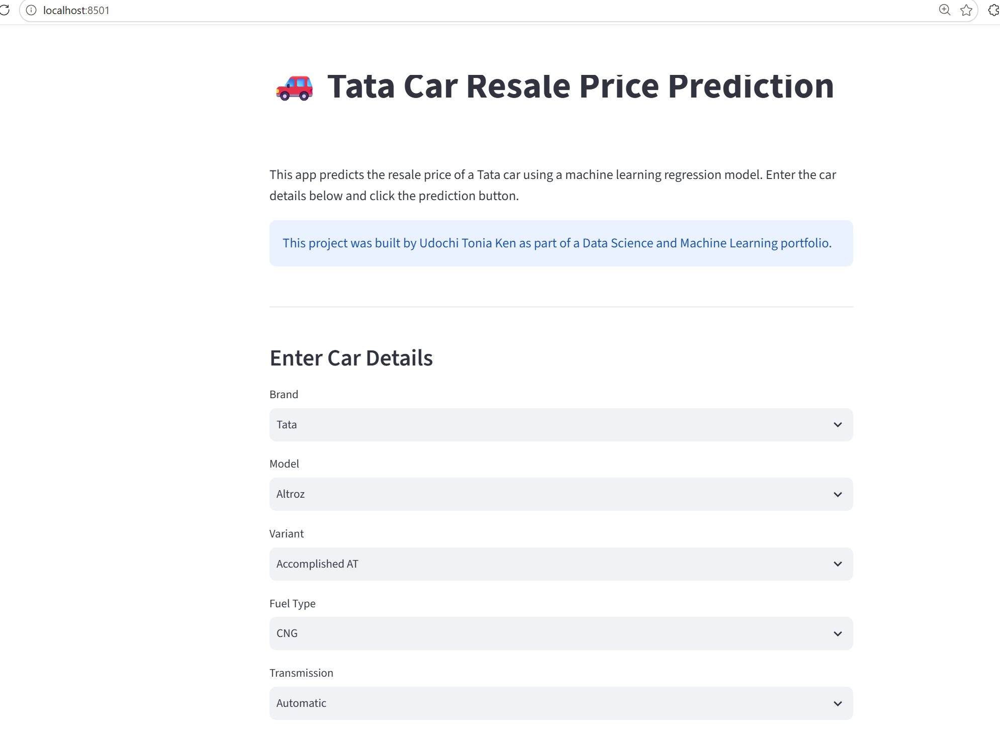

####  Input Form
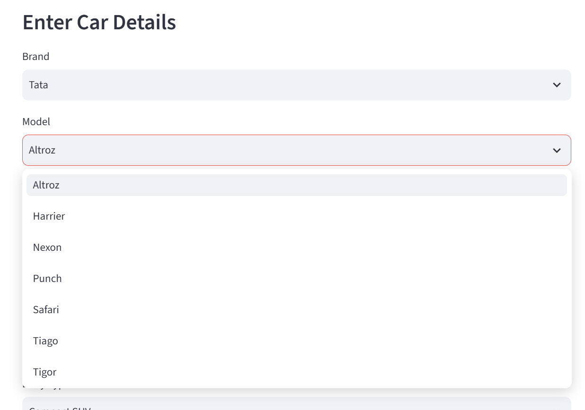

#### Input Form 2
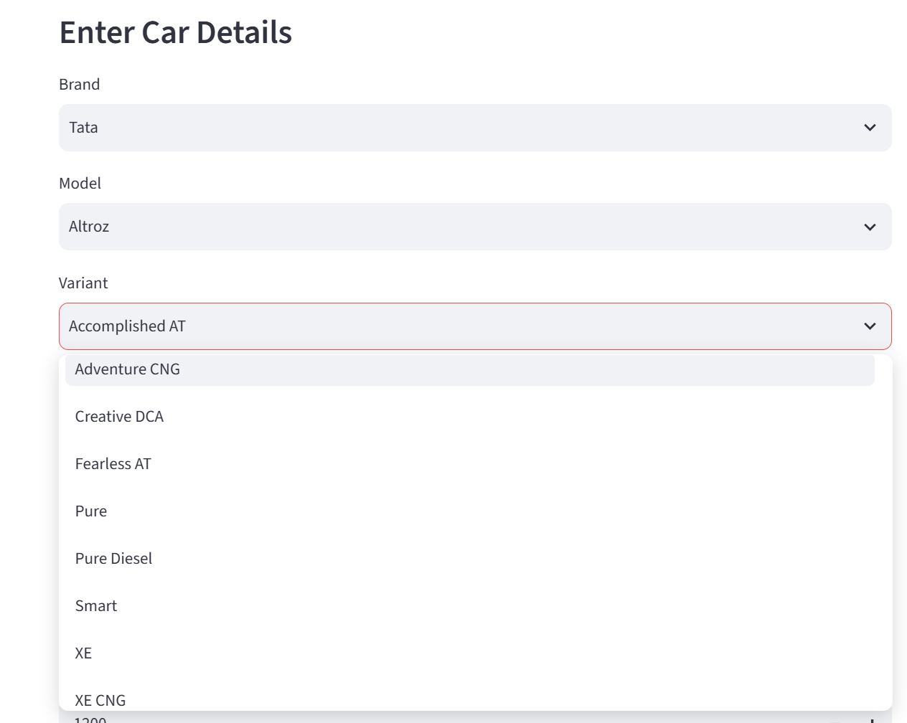

#### Input Form 3
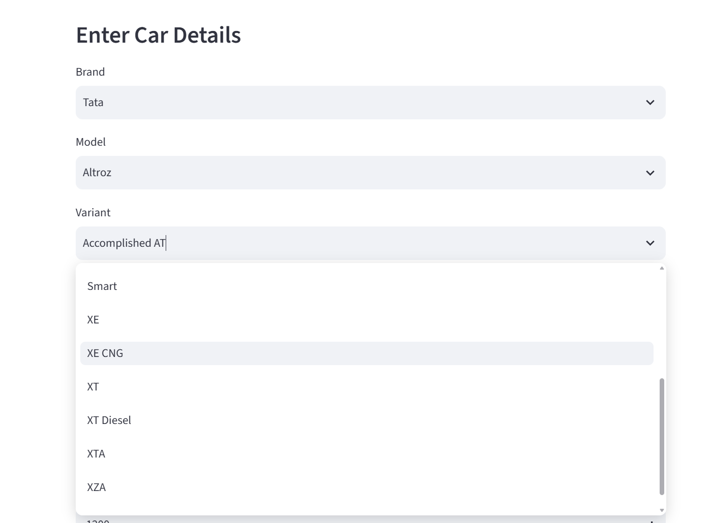

#### Input Form 4
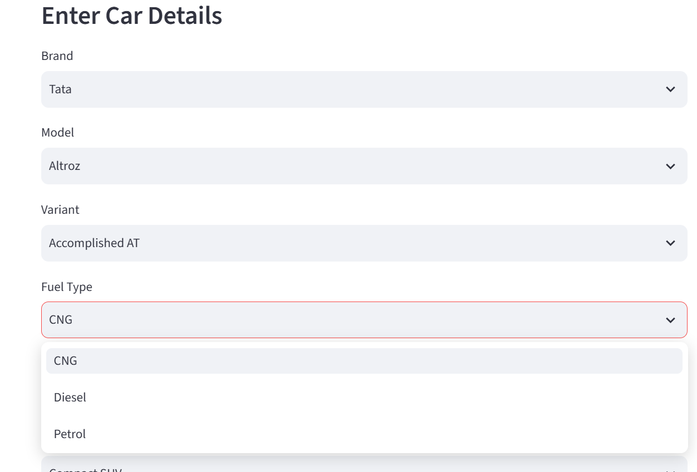

#### Input Form 5
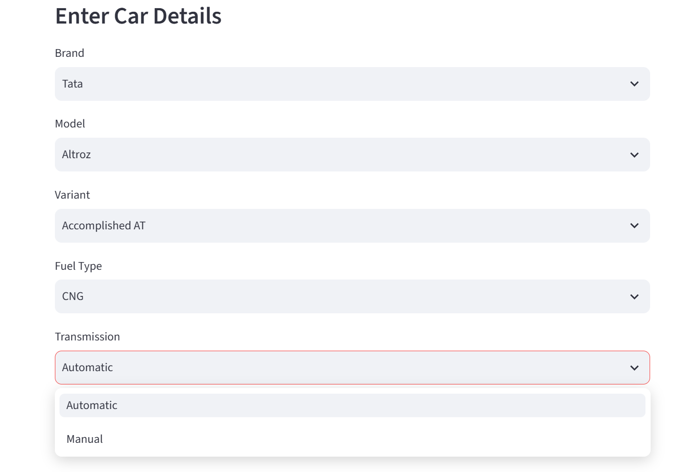

#### Input Form 6
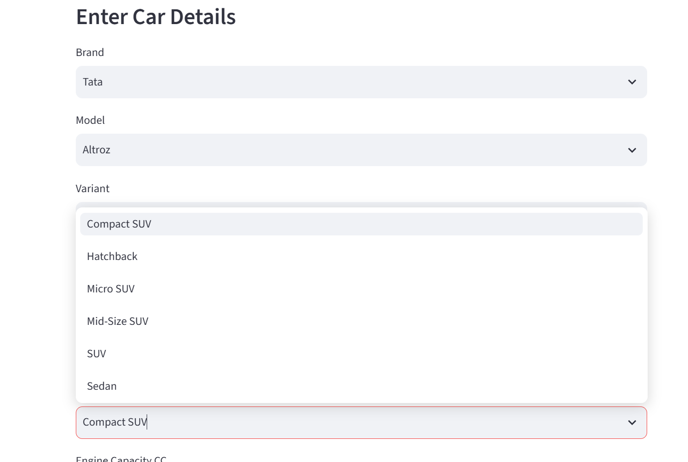

#### Input Form 7
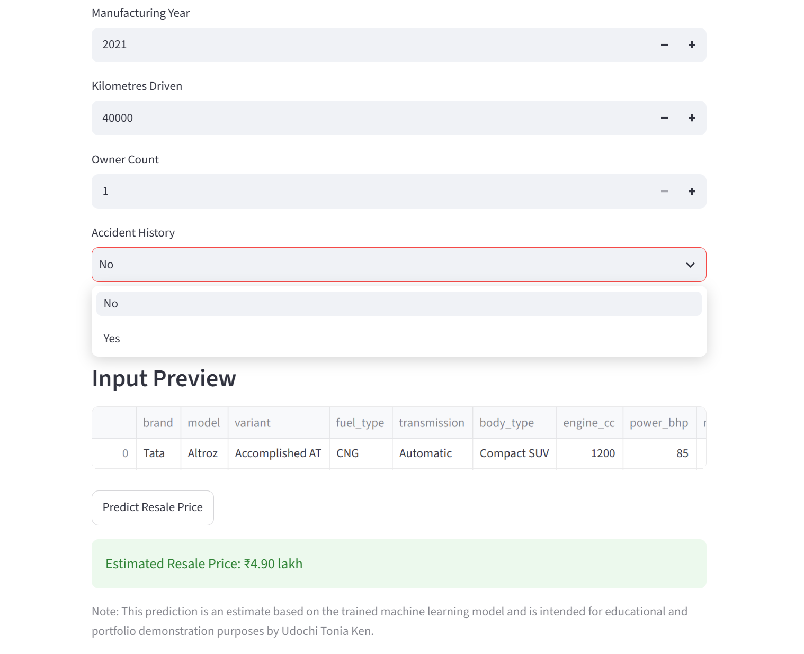

#### Input Form 8
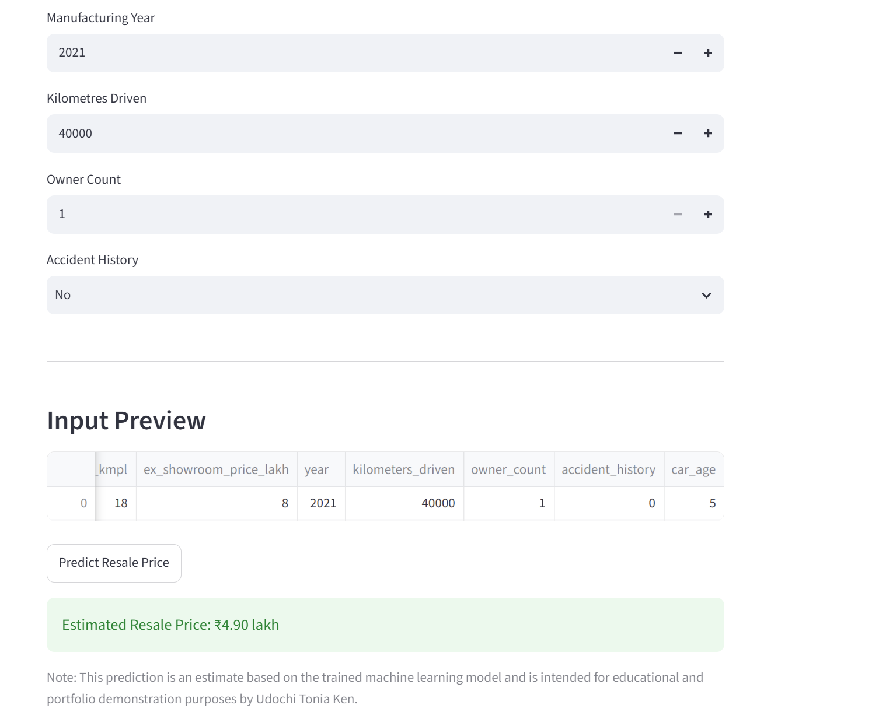

#### Prediction Results
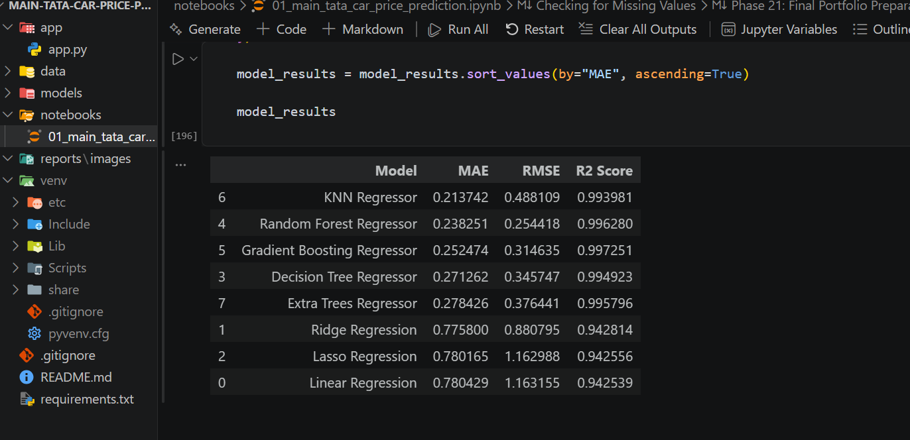

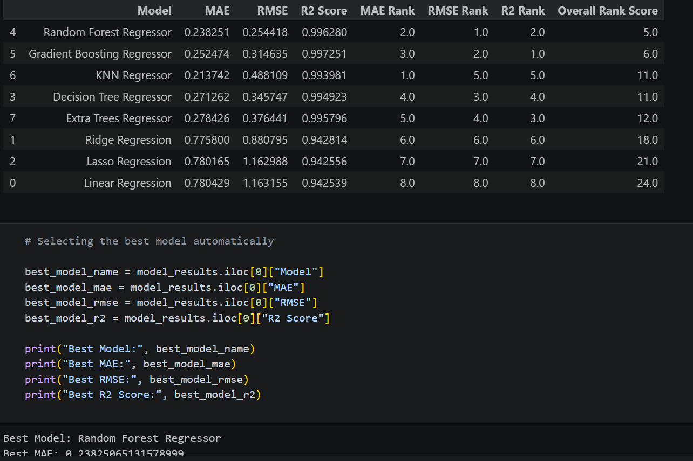

---

### Model Evaluations

#### Best Model
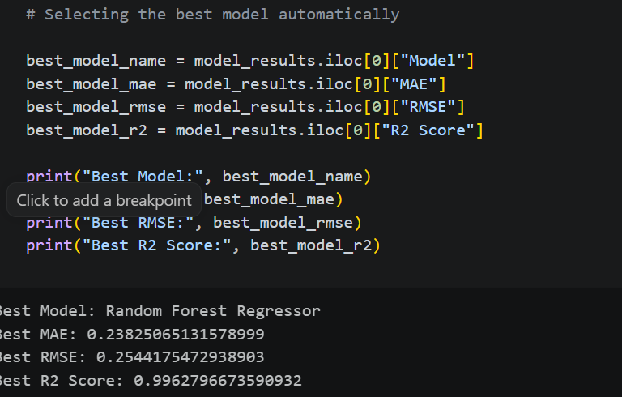

#### MAE Comparison
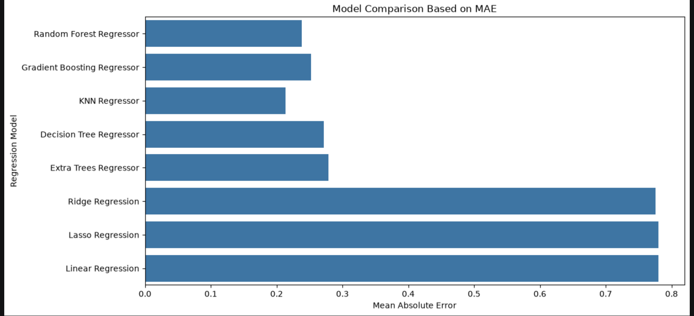

#### RMSE Comparison
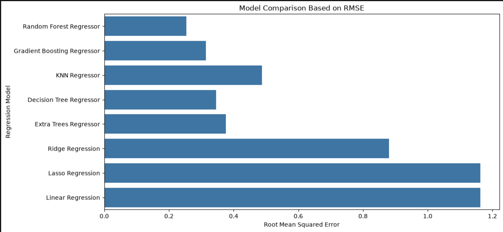

#### R2 Score Comparison
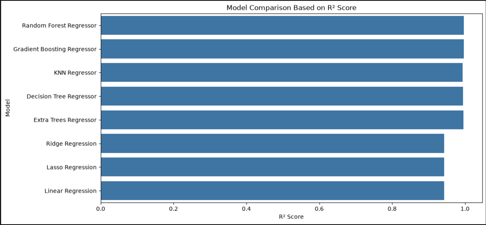
```

```
## Project Architecture

This project follows the full machine learning workflow from data collection to deployment.

The architecture shows how the raw dataset moves through cleaning, EDA, feature engineering, preprocessing, model training, evaluation, best model selection, model saving, and finally deployment using Streamlit.

```text
Dataset
   │
   ▼
Data Cleaning
   │
   ▼
Exploratory Data Analysis (EDA)
   │
   ▼
Feature Engineering
   │
   ▼
Data Preprocessing
   │
   ▼
Model Training
   │
   ▼
Model Evaluation
   │
   ▼
Best Model Selection
   │
   ▼
Model Serialization (.joblib)
   │
   ▼
Streamlit Web Application
   │
   ▼
Tata Car Resale Price Prediction
```

This architecture helps explain how the project moves from raw data to a usable machine learning application.
```

```
## Author

**Udochi Tonia Ken**

Machine Learning | Data Science | Python | Streamlit

GitHub:
https://github.com/Toniaken